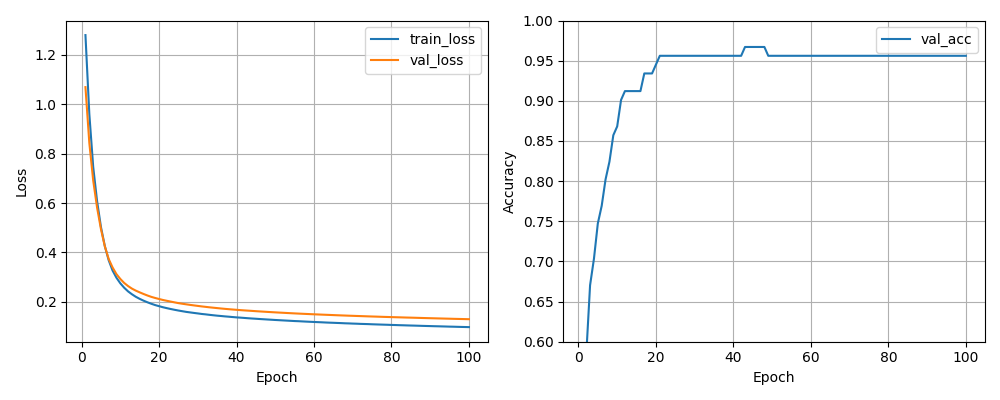
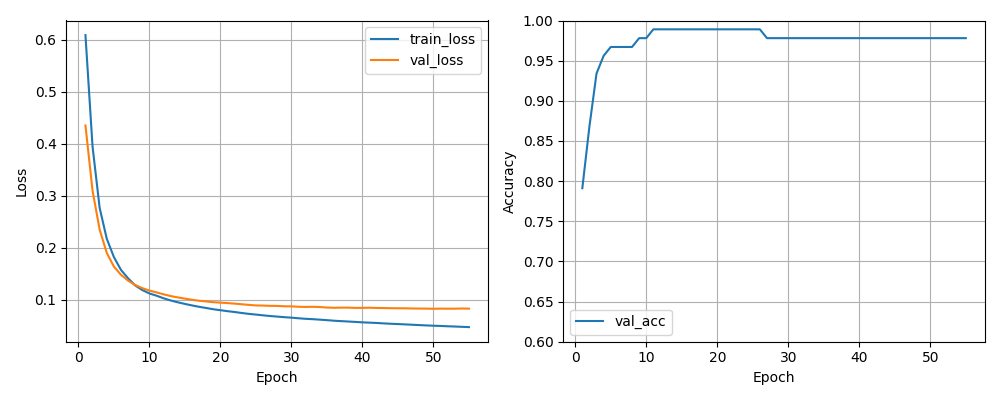
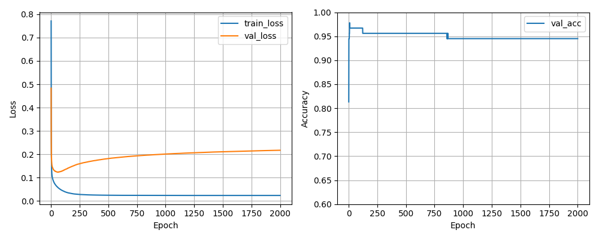

# Multilayer Perceptron

A from-scratch implementation of a multilayer perceptron (MLP) that classifies breast-cancer cell-nucleus measurements as **malignant (M)** or **benign (B)**. The dataset is the Wisconsin Diagnostic Breast Cancer set (569 samples, 30 numeric features).

Only `numpy` is used for the math; no deep-learning libraries. `scikit-learn` is used only for the train/validation split and feature scaling, `matplotlib` for the learning curves, and `joblib` for persisting the scaler.

---

## Files

### Code

| File | Purpose |
| --- | --- |
| `layer.py` | Abstract `Layer` base class with `forward` / `backward` stubs. Every other layer inherits from it. |
| `dense.py` | Fully-connected (dense) layer. He weight initialisation, vanilla SGD update, and optional Nesterov momentum with velocity buffers. |
| `activations.py` | `ReLU`, `Sigmoid`, and `Softmax` layers. The two non-linearities inherit from a generic `Activation` wrapper; `Softmax` is its own `Layer` because it needs the full output vector to compute its Jacobian. |
| `split_data.py` | Splits the raw `data.csv` into `data_train.csv` and `data_eval.csv`. Stratified on the label column so class proportions are preserved. Seedable. |
| `train.py` | Loads the training CSV, standardises features (`StandardScaler`, saved to `scaler.pkl`), builds the network, runs the training loop, plots learning curves, and saves the trained weights to `mlp_model_<name>.npz` plus a `history_<name>.npz`. Can train and compare several configurations in a single run via `--hidden` / `--momentum` / `--names`. |
| `predict.py` | Loads a saved model and the scaler, runs a forward pass on an evaluation CSV, writes predictions to `predictions.csv`, and prints the binary cross-entropy and accuracy. |
| `plot_distributions.py` | Optional EDA helper: plots a histogram (numeric columns) or bar chart (categorical columns) for every feature in the dataset. |

### Data

| File | Purpose |
| --- | --- |
| `data.csv` | Raw dataset (569 rows, headerless). Column 0 is the sample id, column 1 is the diagnosis (`M` / `B`), columns 2–31 are the 30 features. |
| `data_train.csv`, `data_eval.csv` | Output of `split_data.py`. |
| `scaler.pkl` | Fitted `StandardScaler` from training; reused at prediction time so the same mean/std normalisation is applied. |
| `mlp_model_*.npz` | Saved weights and biases for each trained model. |
| `history_*.npz` | Per-epoch train/val loss and accuracy curves. |
| `predictions.csv` | Per-row prediction output (input row + probability + predicted class). |

### Other

| File | Purpose |
| --- | --- |
| `requirements.txt` | Python dependencies (`numpy`, `pandas`, `scikit-learn`, `matplotlib`, `joblib`). |
| `Momentum_E_S.png`, `Overfitting.png`, `SGD.png` | Example learning-curve outputs used as illustrations below. |

---

## Usage

```bash
# 1. Split
python split_data.py data.csv -p 20

# 2. Train (two hidden layers of 24, with Nesterov momentum)
python train.py data_train.csv --hidden 24 24 --momentum 0.9 \
    --epochs 200 --batch 8 --plot-out learning_curves.png

# 3. Predict / evaluate
python predict.py data_eval.csv --model mlp_model_model0.npz --scaler scaler.pkl
```

You can also train and compare several configurations in one go:

```bash
python train.py data_train.csv --hidden 24 24 64 \
    --momentum 0.0 0.9 0.9 --names sgd nesterov_small nesterov_wide \
    --plot-out comparison.png
```

---

## How the network learns

The training loop repeats three steps over the data: **feedforward** to get a prediction, compute the loss, then **backpropagation** to compute gradients and **gradient descent** to update the weights. The three are tightly coupled, but it's easier to understand them one at a time.

### 1. The neuron

A single neuron (a perceptron) computes a weighted sum of its inputs, adds a bias, and pipes the result through a non-linear activation function:

```
z = w₁·x₁ + w₂·x₂ + ... + wₙ·xₙ + b
a = f(z)
```

Stack many of these into a layer and stack several layers, and you get a multilayer perceptron. In matrix form, one dense layer is just `Z = W·X + b`, with `W` of shape `(out_features, in_features)`. That's exactly what `Dense.forward` in `dense.py` does.

The point of the activation function `f` is to introduce non-linearity. Without it, stacking layers would be pointless: a composition of linear maps is still a linear map, so the network could only learn linearly separable problems. ReLU (`max(0, z)`) and Sigmoid (`1 / (1 + e⁻ᶻ)`) are the two used here. The output layer uses **softmax**, which turns a vector of raw scores into a probability distribution over the two classes — `[p(benign), p(malignant)]` summing to 1.

### 2. Feedforward

Feedforward is the prediction step: the input vector enters the first layer, gets transformed, the output is passed to the next layer, and so on until it reaches the output layer. Each layer's output is the next layer's input — data only flows one way, hence *feed-forward*.

In this project, `forward_pass` in `train.py` (and `predict.py`) simply calls `layer.forward(...)` on each layer in order. For our network, a single sample with 30 features flows through:

```
input (30)  →  Dense(30→24)  →  ReLU  →  Dense(24→24)  →  ReLU  →  Dense(24→2)  →  Softmax  →  [p_B, p_M]
```

For training, samples are processed in mini-batches of size 8 (default 64), so the input is actually a `(30, batch_size)` matrix and the output is `(2, batch_size)`.

Once the forward pass is done, we measure how wrong the prediction is with the **categorical cross-entropy loss** (with `y` being the one-hot true label and `p` the softmax output):

```
L = − (1/N) · Σₙ Σₖ  yₙₖ · log(pₙₖ)
```

For two classes, this is mathematically equivalent to the binary cross-entropy in the project subject — the prediction program uses the binary form because it's the standard formula for two-class problems:

```
E = − (1/N) · Σₙ  [yₙ·log(pₙ) + (1−yₙ)·log(1−pₙ)]
```

### 3. Backpropagation

Backpropagation is how the network figures out, for every single weight and bias in the network, "if I nudge this parameter up a little, does the loss go up or down, and by how much?". The answer is the partial derivative of the loss with respect to that parameter — its **gradient**.

The trick is the chain rule. The loss depends on the output, the output depends on the last layer's weights, that layer's input depends on the previous layer's weights, and so on. So we can compute the gradients layer by layer, starting from the output and working backward:

1. Start at the output: compute `∂L/∂z` for the final layer. For softmax + categorical cross-entropy, this simplifies beautifully to `(predicted − one_hot_true)`. That's exactly the line `grad_logits = (y_pred - yb_onehot)` in `train.py`.
2. For each layer, going right to left, take the gradient coming in from the layer in front (`output_gradient`) and produce two things:
   - the gradients of *this layer's parameters* (`dW`, `db`), used to update the weights
   - the gradient with respect to *this layer's input* (`input_gradient`), which is what the previous layer will receive as its `output_gradient`
3. Repeat until you hit the input layer.

Concretely, for a dense layer with `Z = W·X + b`:

```
dW = (output_gradient · Xᵀ) / batch_size       # how the loss changes with each weight
db = mean(output_gradient over the batch)      # how the loss changes with each bias
input_gradient = Wᵀ · output_gradient          # what to hand to the previous layer
```

That's `Dense.backward` in `dense.py`. For an activation layer, there are no parameters to update — `Activation.backward` just multiplies the incoming gradient by the elementwise derivative of the activation function (`(x > 0)` for ReLU, `s·(1−s)` for sigmoid) and passes the result on.

The name "backpropagation" comes from this reverse traversal: the gradient *propagates back* through the network, one layer at a time.

### 4. Gradient descent

Gradients tell us the direction of *steepest ascent* of the loss — so to *minimise* it, we step in the opposite direction. That's gradient descent:

```
W ← W − learning_rate · dW
b ← b − learning_rate · db
```

The **learning rate** controls how big each step is. Too small and training crawls; too large and we overshoot and oscillate (or diverge entirely).

In practice we don't compute the gradient on the full dataset every step — that would be slow and the path would be very smooth, making it easy to get stuck in shallow local minima. Instead we use **mini-batch stochastic gradient descent (SGD)**: shuffle the data, split it into small batches (8 samples here), compute the gradient on each batch, and update. The batch-to-batch noise actually helps the optimiser find better minima.



#### Nesterov momentum

Plain SGD can be slow in narrow valleys of the loss landscape — it bounces from one side to the other instead of moving along the valley. **Momentum** smooths this out by accumulating a running average of past gradients in a velocity buffer `v`, and stepping with the velocity rather than the raw gradient. **Nesterov momentum** is a refinement that "looks ahead" — it evaluates the gradient at the position the velocity is about to push the weights to, which gives a more accurate correction:

```
v_new = β · v_old − lr · dW
W ← W − β · v_old + (1 + β) · v_new       # the Nesterov "look-ahead" update
```

`β` is the momentum coefficient (here `0.9`). `Dense.backward` keeps `vw` and `vb` velocity buffers and uses this update when `momentum > 0`.

The figure below compares plain SGD (left) with Nesterov momentum + early stopping (right) on this dataset — momentum reaches a low validation loss in a fraction of the epochs:



### 5. Putting it together — one epoch

An **epoch** is one full pass over the training set. For each epoch the training loop:

1. Shuffles the training data.
2. Splits it into mini-batches.
3. For each batch: feedforward → compute loss → backpropagate → update weights.
4. After the epoch, runs the full validation set through the network (forward pass only) and records the validation loss and accuracy.

We log all four metrics (`train_loss`, `val_loss`, `train_acc`, `val_acc`) per epoch and plot them at the end. The validation curve is the honest one — training loss can keep dropping while the model gets worse at generalising:



That gap between a still-falling training loss and a rising validation loss is **overfitting** — the network is memorising the training set instead of learning patterns that hold up on unseen data. The fix used here is **early stopping**: if the validation loss hasn't improved for 5 consecutive epochs, training halts and the best-validation-loss weights are kept. You can see early stopping kick in around epoch 55 on the momentum plot above.

---

## Resources

Useful background videos for the intuition behind each concept:

- [But what *is* a neural network?](https://www.youtube.com/watch?v=aircAruvnKk) — feedforward
- [Gradient descent, how neural networks learn](https://www.youtube.com/watch?v=IHZwWFHWa-w) — the loss landscape and SGD
- [What is backpropagation really doing?](https://www.youtube.com/watch?v=Ilg3gGewQ5U) — backprop intuition
- [Backpropagation calculus](https://www.youtube.com/watch?v=tIeHLnjs5U8) — the chain rule, formalised
